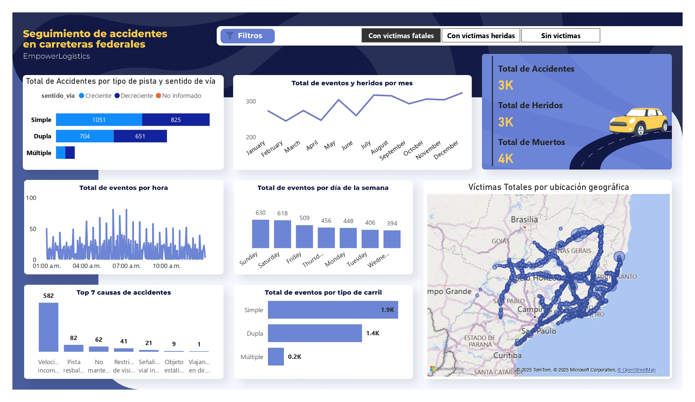

# 🚦 Dashboard de Accidentes de Tránsito – Brasil (2019-2020)

Este repositorio contiene un dashboard en **Power BI** con datos de **accidentes de tránsito registrados en São Paulo (SP) y Minas Gerais (MG), Brasil, durante los años 2019 y 2020**.  
El objetivo es identificar las causas principales, los tipos de colisión más frecuentes y el impacto en víctimas y vehículos involucrados, apoyando iniciativas de seguridad vial.

---

## 📂 Contenido del repositorio
- `Dashboard_Accidentes.pbix` → archivo de Power BI.  
- `BD-Accidentes-Carreteras.xlsx` → base de datos utilizada.  
- Captura del dashboard.  

---

## 📊 Resumen de los accidentes
- **Total de accidentes:** +3,000 
- **Total de heridos:** +3,000 
- **Total de decesos:** +4,000  
- **Causa principal:** Velocidad incompatible 
- **Tipo de carril con más accidentes:** Carril simple  

---

## 🏢 Análisis por estado
### São Paulo (SP)
- Número de accidentes: 137  
- Personas involucradas: 274  
- Heridos totales: 156  
- Municipios con más accidentes: **Queluz, Jacareí, Santa Isabel**  

### Minas Gerais (MG)
- Número de accidentes: 121  
- Personas involucradas: 242  
- Heridos totales: 139  
- Municipios con más accidentes: **Ribeirão das Neves, Governador Valadares, Uberlândia, Matias Barbosa**  

---

## 💡 Insights principales
- El **carril simple** es el más frecuente de los accidentes registrados.      
- Los municipios con mayor concentración de accidentes en cada estado podrían ser **zonas prioritarias de intervención vial**.  

---

## 🖥️ Vista previa

---

## 🚀 Cómo usar este repositorio
1. Descarga el archivo `.pbix`.  
2. Abre el proyecto en **Power BI Desktop**.  
3. Explora las visualizaciones: distribución por estado, tipo de colisión, severidad de lesiones y municipios con más incidentes.  

---
